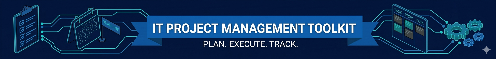

# 🚀 IT Project Management Toolkit & Case Study

A comprehensive collection of professional PM templates and artifacts designed for aspiring Project Managers, Junior PMs, and students of the Google Project Management Certificate.

> **Goal:** To provide a ready-to-use "PM Office" in a box, including blank templates and a completed "Gold Standard" case study for reference.

---

## 📂 Navigation & Modules
Each folder contains industry-standard templates provided in editable formats.

1. [**01-Initiation**](./01-Initiation) - Proposal, Project Charters and Stakeholder Registers.🌟🌿
2. [**02-Planning**](./02-Planning) - RACI Charts, Project Plans, and Communication Strategies.🔥
3. [**03-Execution**](./03-Execution) - Status Reports, Risk Logs, and ROAM Analysis.👾
4. [**04-Closing**](./04-Closing) - Retrospectives and Project Closeout Reports.🏆
5. [**Portfolio Artifacts**](./05-Portfolio) - **End-to-End Implementation:** See the full lifecycle of the "Plant Pals" project implementation.💎

---

## ✨ Why this Toolkit?
* **End-to-End Implementation:** Includes a full implementation as a reference point.
* **Standardized:** Based on the industry-leading Google PM Professional Certificate methodology.
* **IT Focused:** Optimized for IT and software development workflows.

## ⭐ How to Support
If you find these templates helpful for your PM journey, please **give this repository a star!** It helps other aspiring PMs find these resources and supports my professional growth.

## 👩🏻‍💻 About the Author
I am an aspiring Project Manager focused on the IT and GameDev industries. 
* [**My LinkedIn**](https://www.linkedin.com/in/valeriia-bovsunovska-aa8615312/)
